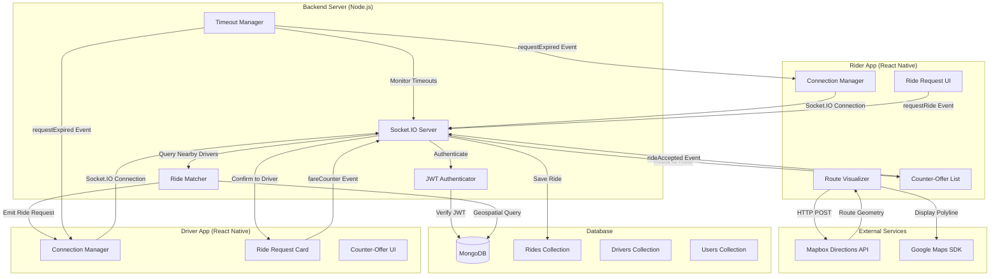
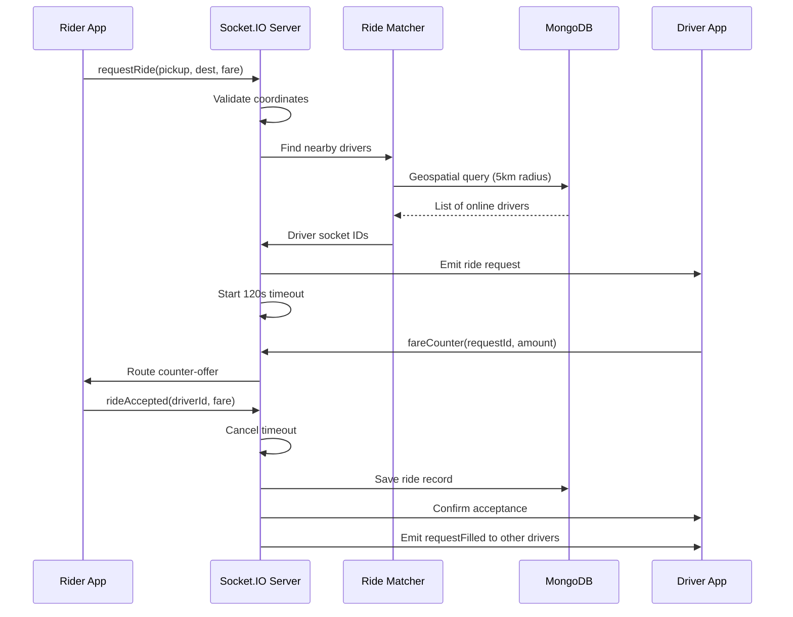

# Design Document: Real-Time Ride Matching

## Overview

The Real-Time Ride Matching feature enables bidirectional communication between riders and drivers through Socket.IO, implementing an InDrive-style fare negotiation system. The system integrates Google Maps route visualization with Mapbox Directions API and handles Afghanistan's challenging network conditions through robust connection management and event queuing.

### Key Design Goals

1. **Real-time Communication**: Sub-second latency for ride requests and counter-offers using Socket.IO
2. **Network Resilience**: Graceful degradation and automatic recovery in poor connectivity environments
3. **Geographic Efficiency**: Spatial indexing for fast nearby driver queries within 5km radius
4. **State Consistency**: Prevent race conditions in concurrent ride acceptances and request expirations
5. **RTL Support**: Full right-to-left layout support for Dari and Pashto languages
6. **Testability**: Property-based testing for core business logic with 100+ iterations per property

### Technology Stack

- **Backend**: Node.js + Express + Socket.IO 4.8.3
- **Database**: MongoDB with 2dsphere geospatial indexing
- **Mobile Apps**: React Native (Expo) with socket.io-client
- **Maps**: Google Maps (react-native-maps) + Mapbox Directions API
- **Authentication**: JWT tokens for Socket.IO connection authentication
- **Testing**: Jest + fast-check (property-based testing library for JavaScript)

## Architecture

### System Architecture Diagram



### Component Interaction Flow

#### Ride Request Flow


### Data Flow Architecture

1. **Route Visualization Flow**: Rider selects coordinates → HTTP POST to `/api/navigation/directions` → Mapbox API query → Return GeoJSON geometry → Render polyline on Google Maps
2. **Connection Management Flow**: App launch → Socket.IO connect → JWT authentication → Subscribe to user-specific channel → Maintain heartbeat
3. **Ride Request Flow**: Rider confirms → Validate inputs → Emit `requestRide` → Server queries nearby drivers → Broadcast to driver sockets → Start timeout timer
4. **Counter-Offer Flow**: Driver submits → Emit `fareCounter` → Server routes to rider socket → Display in sorted list → Play notification
5. **Acceptance Flow**: Rider/Driver accepts → Emit `rideAccepted` → Server validates (first wins) → Update database → Notify both parties → Emit `requestFilled` to other drivers

## Components and Interfaces

### Backend Components

#### 1. Socket.IO Server (`socketServer.js`)

**Responsibilities**:
- Manage WebSocket connections for riders and drivers
- Authenticate connections using JWT tokens
- Route events between riders and drivers
- Maintain socket-to-user mappings

**Interface**:
```javascript
class SocketServer {
  constructor(httpServer, jwtSecret)
  
  // Connection lifecycle
  handleConnection(socket)
  handleDisconnection(socket)
  authenticateSocket(socket, token) // Returns userId or throws error
  
  // Event handlers
  onRequestRide(socket, payload)
  onFareCounter(socket, payload)
  onRideAccepted(socket, payload)
  onDriverStatusChange(socket, payload)
  
  // Utility methods
  emitToUser(userId, eventName, payload)
  emitToDrivers(driverIds, eventName, payload)
  getUserSocket(userId) // Returns socket or null
}
```

**Event Schema**:
```javascript
// Incoming Events
{
  requestRide: {
    pickup: { lat: Number, lng: Number },
    destination: { lat: Number, lng: Number },
    proposedFare: Number,
    riderProfile: { name: String, rating: Number }
  },
  
  fareCounter: {
    requestId: String,
    driverId: String,
    counterAmount: Number
  },
  
  rideAccepted: {
    requestId: String,
    driverId: String,
    acceptedFare: Number
  },
  
  driverStatusChange: {
    status: 'ONLINE' | 'OFFLINE',
    location: { lat: Number, lng: Number }
  }
}

// Outgoing Events
{
  rideRequest: {
    requestId: String,
    pickup: { lat: Number, lng: Number, landmarkName: String },
    destination: { lat: Number, lng: Number, landmarkName: String },
    proposedFare: Number,
    riderRating: Number,
    estimatedDistance: Number,
    createdAt: Date
  },
  
  fareCounter: {
    requestId: String,
    driverId: String,
    driverName: String,
    driverRating: Number,
    counterAmount: Number,
    timestamp: Date
  },
  
  rideAccepted: {
    requestId: String,
    driverId: String,
    riderId: String,
    acceptedFare: Number,
    driverDetails: Object,
    riderDetails: Object
  },
  
  requestExpired: {
    requestId: String
  },
  
  requestFilled: {
    requestId: String
  },
  
  error: {
    code: String,
    message: String
  }
}
```

#### 2. Ride Matcher (`rideMatcher.js`)

**Responsibilities**:
- Query nearby drivers using geospatial indexing
- Filter drivers by status (ONLINE only)
- Exclude drivers currently on rides
- Calculate estimated distances

**Interface**:
```javascript
class RideMatcher {
  constructor(driverModel)
  
  async findNearbyDrivers(pickupCoords, radiusKm = 5)
  // Returns: Array<{ driverId, socketId, location, distance }>
  
  async getDriverSocketIds(driverIds)
  // Returns: Array<String> socket IDs
  
  validateCoordinates(lat, lng)
  // Returns: Boolean
  
  isWithinAfghanistan(lat, lng)
  // Returns: Boolean (lat: 29-38, lng: 60-75)
}
```

**Geospatial Query**:
```javascript
// MongoDB 2dsphere index query
db.drivers.find({
  status: 'ONLINE',
  currentLocation: {
    $near: {
      $geometry: {
        type: 'Point',
        coordinates: [lng, lat] // Note: GeoJSON uses [lng, lat]
      },
      $maxDistance: 5000 // meters
    }
  }
})
```

#### 3. Timeout Manager (`timeoutManager.js`)

**Responsibilities**:
- Track active ride requests with 120-second timeouts
- Emit `requestExpired` events when timeouts occur
- Cancel timeouts when rides are accepted
- Clean up expired request data

**Interface**:
```javascript
class TimeoutManager {
  constructor(socketServer)
  
  startTimeout(requestId, riderId, driverIds)
  // Starts 120s timer, stores driver list for cleanup
  
  cancelTimeout(requestId)
  // Cancels timer, prevents expiration event
  
  handleExpiration(requestId)
  // Emits requestExpired to rider and all drivers
  
  getActiveRequests()
  // Returns: Map<requestId, { riderId, driverIds, expiresAt }>
}
```

**Implementation**:
```javascript
class TimeoutManager {
  constructor(socketServer) {
    this.socketServer = socketServer;
    this.activeRequests = new Map(); // requestId -> { riderId, driverIds, timer }
  }
  
  startTimeout(requestId, riderId, driverIds) {
    const timer = setTimeout(() => {
      this.handleExpiration(requestId);
    }, 120000); // 120 seconds
    
    this.activeRequests.set(requestId, {
      riderId,
      driverIds,
      timer,
      expiresAt: Date.now() + 120000
    });
  }
  
  cancelTimeout(requestId) {
    const request = this.activeRequests.get(requestId);
    if (request) {
      clearTimeout(request.timer);
      this.activeRequests.delete(requestId);
    }
  }
  
  handleExpiration(requestId) {
    const request = this.activeRequests.get(requestId);
    if (!request) return;
    
    // Emit to rider
    this.socketServer.emitToUser(request.riderId, 'requestExpired', { requestId });
    
    // Emit to all drivers who received the request
    this.socketServer.emitToDrivers(request.driverIds, 'requestExpired', { requestId });
    
    this.activeRequests.delete(requestId);
  }
}
```

#### 4. Connection Authenticator (`connectionAuth.js`)

**Responsibilities**:
- Verify JWT tokens on Socket.IO connection
- Extract user ID and role from token
- Reject invalid or expired tokens

**Interface**:
```javascript
class ConnectionAuthenticator {
  constructor(jwtSecret)
  
  async authenticate(token)
  // Returns: { userId, role: 'rider' | 'driver' } or throws error
  
  generateToken(userId, role)
  // Returns: JWT token string
}
```

### Frontend Components (React Native)

#### 1. Connection Manager (`useSocketConnection.ts`)

**Responsibilities**:
- Establish and maintain Socket.IO connection
- Handle reconnection with exponential backoff
- Queue events during disconnection
- Display connection status to user

**Interface**:
```typescript
interface ConnectionManager {
  connect(): void
  disconnect(): void
  emit(eventName: string, payload: any): Promise<void>
  on(eventName: string, handler: Function): void
  off(eventName: string, handler: Function): void
  isConnected: boolean
  connectionStatus: 'connected' | 'disconnected' | 'reconnecting'
}

// React Hook
function useSocketConnection(authToken: string): ConnectionManager
```

**Implementation Strategy**:
```typescript
// Exponential backoff configuration
const RECONNECT_DELAYS = [1000, 2000, 5000, 10000, 30000]; // ms

// Event queue for offline events
const eventQueue: Array<{ event: string, payload: any }> = [];

// Socket.IO client configuration
const socket = io(BACKEND_URL, {
  auth: { token: authToken },
  reconnection: true,
  reconnectionDelay: 1000,
  reconnectionDelayMax: 30000,
  reconnectionAttempts: Infinity,
  transports: ['websocket', 'polling'] // Fallback to polling for poor networks
});
```

#### 2. Route Visualizer (`RouteVisualizer.tsx`)

**Responsibilities**:
- Query Directions API when coordinates change
- Render polyline on Google Maps
- Display distance and duration
- Handle loading and error states

**Interface**:
```typescript
interface RouteVisualizerProps {
  pickup: { lat: number, lng: number } | null
  destination: { lat: number, lng: number } | null
  onRouteCalculated?: (route: RouteData) => void
}

interface RouteData {
  distance: number // meters
  duration: number // seconds
  geometry: GeoJSON.LineString
}

function RouteVisualizer(props: RouteVisualizerProps): JSX.Element
```

**State Management**:
```typescript
type RouteState = 
  | { status: 'idle' }
  | { status: 'loading' }
  | { status: 'success', data: RouteData }
  | { status: 'error', error: string }
```

#### 3. Ride Request Manager (`useRideRequest.ts`)

**Responsibilities**:
- Emit ride request events
- Track request timeout (120s)
- Manage counter-offer list
- Handle ride acceptance

**Interface**:
```typescript
interface RideRequestManager {
  requestRide(params: RideRequestParams): Promise<void>
  cancelRequest(): void
  acceptCounterOffer(driverId: string, fare: number): Promise<void>
  counterOffers: CounterOffer[]
  requestStatus: 'idle' | 'pending' | 'expired' | 'accepted'
  timeRemaining: number // seconds
}

interface RideRequestParams {
  pickup: Coordinates
  destination: Coordinates
  proposedFare: number
  riderProfile: { name: string, rating: number }
}

interface CounterOffer {
  driverId: string
  driverName: string
  driverRating: number
  amount: number
  timestamp: Date
}

function useRideRequest(socket: ConnectionManager): RideRequestManager
```

#### 4. Driver Request Handler (`useDriverRequests.ts`)

**Responsibilities**:
- Listen for incoming ride requests
- Display ride request cards
- Handle counter-offer submission
- Handle direct acceptance

**Interface**:
```typescript
interface DriverRequestHandler {
  activeRequests: RideRequest[]
  submitCounterOffer(requestId: string, amount: number): Promise<void>
  acceptRide(requestId: string): Promise<void>
  rejectRide(requestId: string): void
}

interface RideRequest {
  requestId: string
  pickup: LocationData
  destination: LocationData
  proposedFare: number
  riderRating: number
  estimatedDistance: number
  receivedAt: Date
}

interface LocationData {
  lat: number
  lng: number
  landmarkName?: string
}

function useDriverRequests(socket: ConnectionManager): DriverRequestHandler
```

### Validation Components

#### Coordinate Validator (`coordinateValidator.ts`)

**Responsibilities**:
- Validate latitude/longitude ranges
- Check Afghanistan geographic boundaries
- Sanitize coordinate inputs

**Interface**:
```typescript
class CoordinateValidator {
  static isValidLatitude(lat: number): boolean
  // Returns: true if -90 <= lat <= 90
  
  static isValidLongitude(lng: number): boolean
  // Returns: true if -180 <= lng <= 180
  
  static isValidCoordinatePair(lat: number, lng: number): boolean
  // Returns: true if both lat and lng are valid
  
  static isWithinAfghanistan(lat: number, lng: number): boolean
  // Returns: true if 29 <= lat <= 38 AND 60 <= lng <= 75
  
  static sanitizeCoordinate(value: any): number | null
  // Converts to number, returns null if invalid
}
```

#### Fare Validator (`fareValidator.ts`)

**Responsibilities**:
- Validate fare amounts are positive
- Check reasonable fare ranges
- Format fare for display

**Interface**:
```typescript
class FareValidator {
  static isValidFare(amount: number): boolean
  // Returns: true if amount > 0
  
  static formatFare(amount: number, locale: string): string
  // Returns: "۱۲۳ AFN" for Dari/Pashto, "123 AFN" for English
  
  static isReasonableFare(amount: number, distanceKm: number): boolean
  // Returns: true if fare is within expected range for distance
}
```

## Data Models

### MongoDB Schemas

#### Extended Ride Model

```javascript
const rideSchema = new mongoose.Schema({
  riderId: {
    type: mongoose.Schema.Types.ObjectId,
    ref: 'User',
    required: true,
    index: true
  },
  driverId: {
    type: mongoose.Schema.Types.ObjectId,
    ref: 'Driver',
    index: true
  },
  pickup: {
    lat: { type: Number, required: true },
    lng: { type: Number, required: true },
    landmarkName: { type: String, default: '' }
  },
  destination: {
    lat: { type: Number, required: true },
    lng: { type: Number, required: true },
    landmarkName: { type: String, default: '' }
  },
  status: {
    type: String,
    enum: ['Pending', 'Negotiating', 'Accepted', 'InProgress', 'Completed', 'Cancelled', 'Expired'],
    default: 'Pending',
    index: true
  },
  proposedFare: {
    type: Number,
    required: true,
    min: 0
  },
  agreedFare: {
    type: Number,
    min: 0
  },
  counterOffers: [{
    driverId: { type: mongoose.Schema.Types.ObjectId, ref: 'Driver' },
    amount: { type: Number, required: true },
    timestamp: { type: Date, default: Date.now }
  }],
  estimatedDistance: {
    type: Number, // meters
    required: true
  },
  estimatedDuration: {
    type: Number, // seconds
    required: true
  },
  routeGeometry: {
    type: Object, // GeoJSON LineString
    required: false
  },
  commissionAmount: {
    type: Number,
    default: 0
  },
  expiresAt: {
    type: Date,
    index: true // For cleanup queries
  },
  acceptedAt: {
    type: Date
  },
  createdAt: {
    type: Date,
    default: Date.now,
    index: true
  }
});

// Compound index for active ride queries
rideSchema.index({ riderId: 1, status: 1 });
rideSchema.index({ driverId: 1, status: 1 });

// TTL index for automatic cleanup of expired requests (optional)
rideSchema.index({ expiresAt: 1 }, { expireAfterSeconds: 0 });
```

#### Extended Driver Model

```javascript
const driverSchema = new mongoose.Schema({
  phoneNumber: {
    type: String,
    required: true,
    unique: true,
    index: true
  },
  name: {
    type: String,
    required: true
  },
  rating: {
    type: Number,
    default: 5.0,
    min: 0,
    max: 5
  },
  totalRides: {
    type: Number,
    default: 0
  },
  vehicleDetails: {
    make: String,
    model: String,
    color: String,
    plateNumber: String
  },
  commissionBalance: {
    type: Number,
    default: 0
  },
  tazkiraVerified: {
    type: Boolean,
    default: false
  },
  status: {
    type: String,
    enum: ['ONLINE', 'OFFLINE', 'IN_RIDE'],
    default: 'OFFLINE',
    index: true
  },
  currentLocation: {
    type: {
      type: String,
      enum: ['Point'],
      default: 'Point'
    },
    coordinates: {
      type: [Number], // [longitude, latitude]
      default: [0, 0]
    }
  },
  lastLocationUpdate: {
    type: Date,
    default: Date.now
  },
  socketId: {
    type: String,
    default: null // Current socket connection ID
  },
  createdAt: {
    type: Date,
    default: Date.now
  }
});

// 2dsphere index for geospatial queries
driverSchema.index({ currentLocation: '2dsphere' });

// Compound index for nearby driver queries
driverSchema.index({ status: 1, currentLocation: '2dsphere' });
```

#### Extended User Model

```javascript
const userSchema = new mongoose.Schema({
  phoneNumber: {
    type: String,
    required: true,
    unique: true,
    index: true
  },
  name: {
    type: String,
    default: ''
  },
  rating: {
    type: Number,
    default: 5.0,
    min: 0,
    max: 5
  },
  totalRides: {
    type: Number,
    default: 0
  },
  language: {
    type: String,
    enum: ['Dari', 'Pashto', 'English'],
    default: 'Dari'
  },
  isActive: {
    type: Boolean,
    default: true
  },
  socketId: {
    type: String,
    default: null // Current socket connection ID
  },
  createdAt: {
    type: Date,
    default: Date.now
  }
});
```

### In-Memory Data Structures

#### Socket-to-User Mapping

```javascript
// Maintained in Socket.IO server memory
const socketToUser = new Map(); // socketId -> { userId, role: 'rider' | 'driver' }
const userToSocket = new Map(); // userId -> socketId
```

#### Active Request Tracking

```javascript
// Maintained by TimeoutManager
const activeRequests = new Map(); // requestId -> { riderId, driverIds, timer, expiresAt }
```

#### Event Queue (Client-Side)

```typescript
// Maintained by Connection Manager during disconnection
interface QueuedEvent {
  eventName: string
  payload: any
  timestamp: number
  retryCount: number
}

const eventQueue: QueuedEvent[] = [];
```

## Correctness Properties

*A property is a characteristic or behavior that should hold true across all valid executions of a system—essentially, a formal statement about what the system should do. Properties serve as the bridge between human-readable specifications and machine-verifiable correctness guarantees.*

### Property Reflection

After analyzing all acceptance criteria, I identified the following redundancies and consolidation opportunities:

**Redundancies Identified:**
1. Properties 1.3 and 1.4 (distance and duration display) can be combined into a single property about route data display
2. Properties 3.2 and 3.3 (pickup and destination coordinate validation) are identical logic and can be combined
3. Properties 5.2 and 5.3 (pickup and destination location display) use the same conditional logic and can be combined
4. Properties 8.4 and 9.5 (timer cancellation on acceptance) are testing the same behavior from different entry points
5. Properties 12.1 and 12.2 (latitude and longitude validation) can be combined into coordinate pair validation
6. Properties 12.3 and 12.4 (pickup and destination Afghanistan boundary validation) use the same logic
7. Properties 13.1 and 13.2 (RTL layout for rider and driver apps) test the same layout logic
8. Properties 13.3 and 13.4 (currency formatting in RTL for both apps) test the same formatting logic
9. Properties 4.4 and 4.5 (subscription management on status change) can be combined into a single property about status-subscription consistency

**Consolidation Strategy:**
- Combine coordinate validation properties into comprehensive validation properties
- Merge display formatting properties that share the same logic
- Consolidate timer cancellation into a single property
- Combine RTL properties that test the same layout behavior across apps

### Correctness Properties

### Property 1: Route Data Display Completeness

*For any* valid route response from the Directions API, the Route Visualizer SHALL display both estimated distance (in kilometers) and estimated duration (in minutes).

**Validates: Requirements 1.3, 1.4**

### Property 2: Coordinate Change Triggers Re-query

*For any* coordinate change (pickup or destination), the Route Visualizer SHALL clear the previous polyline and initiate a new Directions API query.

**Validates: Requirements 1.6**

### Property 3: Exponential Backoff Calculation

*For any* sequence of reconnection attempts, the Connection Manager SHALL calculate backoff delays following an exponential pattern with a maximum cap of 30 seconds.

**Validates: Requirements 2.3**

### Property 4: Subscription Restoration on Reconnection

*For any* reconnection event after disconnection, the Connection Manager SHALL restore all previously active event subscriptions.

**Validates: Requirements 2.4**

### Property 5: Authentication Event on Connection

*For any* Socket.IO connection establishment, the Connection Manager SHALL emit an authentication event containing the user's JWT token.

**Validates: Requirements 2.6**

### Property 6: Ride Request Event Completeness

*For any* confirmed ride request, the emitted `requestRide` event SHALL contain all required fields: pickup coordinates, destination coordinates, proposed fare, and rider profile information.

**Validates: Requirements 3.1**

### Property 7: Coordinate Pair Validation

*For any* coordinate pair, the validation function SHALL return true if and only if latitude is in range [-90, 90] AND longitude is in range [-180, 180].

**Validates: Requirements 3.2, 3.3, 12.1, 12.2**

### Property 8: Fare Positivity Validation

*For any* fare amount, the validation function SHALL return true if and only if the amount is greater than zero.

**Validates: Requirements 3.4, 6.2**

### Property 9: Request Timeout Initialization

*For any* ride request emission, a timeout timer SHALL be started with a duration of exactly 120 seconds.

**Validates: Requirements 3.6, 15.1**

### Property 10: Nearby Driver Radius Filtering

*For any* pickup location and set of driver positions, the nearby driver query SHALL return only drivers whose distance from the pickup location is less than or equal to 5 kilometers.

**Validates: Requirements 4.1**

### Property 11: Ride Request Broadcast Completeness

*For any* list of nearby drivers, the Socket Server SHALL emit the ride request event to all drivers in the list.

**Validates: Requirements 4.2**

### Property 12: Ride Request Payload Completeness

*For any* ride request distributed to drivers, the emitted event SHALL contain all required fields: pickup coordinates, destination coordinates, proposed fare, rider rating, estimated distance, and unique request identifier.

**Validates: Requirements 4.3**

### Property 13: Driver Subscription Status Consistency

*For any* driver status change, the driver SHALL be subscribed to ride requests if and only if their status is "ONLINE".

**Validates: Requirements 4.4, 4.5**

### Property 14: Active Ride Exclusion

*For any* ride request distribution, drivers with status "IN_RIDE" SHALL NOT receive the ride request event.

**Validates: Requirements 4.6**

### Property 15: Ride Request Card Display Completeness

*For any* received ride request event, the displayed card SHALL contain all required fields: pickup location, destination location, proposed fare, rider rating, and estimated distance.

**Validates: Requirements 5.1**

### Property 16: Location Display Conditional Formatting

*For any* location data (pickup or destination), the display SHALL show the landmark name if available, otherwise SHALL show the coordinates.

**Validates: Requirements 5.2, 5.3**

### Property 17: Currency Formatting

*For any* fare amount, the display SHALL include the "AFN" currency symbol and proper number formatting.

**Validates: Requirements 5.4**

### Property 18: Rating Display Range

*For any* rating value between 0 and 5, the display SHALL show the rating as stars out of 5.

**Validates: Requirements 5.5**

### Property 19: Distance Display Formatting

*For any* distance value in meters, the display SHALL convert and show the value in kilometers.

**Validates: Requirements 5.6**

### Property 20: Offline Request Filtering

*For any* ride requests received while driver status is "OFFLINE", none SHALL be displayed.

**Validates: Requirements 5.7**

### Property 21: Counter-Offer Event Completeness

*For any* valid counter-offer submission, the emitted `fareCounter` event SHALL contain all required fields: request identifier, driver identifier, and counter-offer amount.

**Validates: Requirements 6.3**

### Property 22: Multiple Counter-Offers Allowed

*For any* ride request, the system SHALL accept and process multiple counter-offer submissions from the same driver.

**Validates: Requirements 6.5**

### Property 23: Counter-Offer Routing Correctness

*For any* counter-offer event, the Socket Server SHALL route the event to the rider who created the corresponding ride request.

**Validates: Requirements 7.1**

### Property 24: Counter-Offer Display Completeness

*For any* received counter-offer event, the display SHALL show driver name, driver rating, and counter-offer amount.

**Validates: Requirements 7.2**

### Property 25: Counter-Offer List Sorting Idempotence

*For any* list of counter-offers, sorting by amount in ascending order and then sorting again SHALL produce the same list (idempotence property).

**Validates: Requirements 7.3**

### Property 26: Accept Button Presence

*For any* displayed counter-offer, an "Accept" button SHALL be present in the UI.

**Validates: Requirements 7.4**

### Property 27: Elapsed Time Calculation

*For any* counter-offer with a timestamp, the displayed elapsed time SHALL equal the difference between the current time and the timestamp.

**Validates: Requirements 7.7**

### Property 28: Ride Acceptance Event Completeness

*For any* ride acceptance (by rider or driver), the emitted `rideAccepted` event SHALL contain all required fields: request identifier, driver identifier, and accepted fare amount.

**Validates: Requirements 8.1, 9.1**

### Property 29: Counter-Offer Dismissal on Acceptance

*For any* ride acceptance, all other counter-offers for that ride request SHALL be dismissed from the UI.

**Validates: Requirements 8.2**

### Property 30: Timeout Cancellation on Acceptance

*For any* ride acceptance event, the associated request timeout timer SHALL be cancelled.

**Validates: Requirements 8.4, 9.5, 15.6**

### Property 31: Single Acceptance Enforcement

*For any* ride request, only the first acceptance attempt SHALL succeed; subsequent acceptance attempts for the same request SHALL be rejected.

**Validates: Requirements 8.5**

### Property 32: Rejection Side-Effect Freedom

*For any* ride request rejection by a driver, no events SHALL be emitted and the driver's state (status, rating, subscription) SHALL remain unchanged.

**Validates: Requirements 10.1, 10.2**

### Property 33: Subscription Persistence After Rejection

*For any* ride request rejection, the driver SHALL remain subscribed to receive new ride requests.

**Validates: Requirements 10.3**

### Property 34: Unlimited Rejections

*For any* sequence of ride request rejections by a driver, all rejections SHALL be processed successfully without limit.

**Validates: Requirements 10.4**

### Property 35: Event Queuing on Disconnection

*For any* Socket.IO event emission that fails due to disconnection, the event SHALL be added to a queue and retried when connection is restored.

**Validates: Requirements 11.2**

### Property 36: State Synchronization on Reconnection

*For any* reconnection event, the Connection Manager SHALL synchronize the current local state with the Socket Server state.

**Validates: Requirements 11.6**

### Property 37: Afghanistan Geographic Boundary Validation

*For any* coordinates (pickup or destination), the server validation SHALL return true if and only if latitude is in range [29, 38] AND longitude is in range [60, 75].

**Validates: Requirements 12.3, 12.4**

### Property 38: Invalid Coordinate Error Response

*For any* invalid coordinates received by the Socket Server, an error event SHALL be emitted back to the sender.

**Validates: Requirements 12.5**

### Property 39: Validation Before API Query

*For any* Directions API query attempt, coordinate validation SHALL occur before the API call is made.

**Validates: Requirements 12.6**

### Property 40: RTL Layout Application

*For any* app language setting of Dari or Pashto, all ride request UI elements SHALL be displayed in right-to-left layout.

**Validates: Requirements 13.1, 13.2**

### Property 41: RTL Currency Symbol Positioning

*For any* fare amount displayed when RTL mode is active, the AFN currency symbol SHALL be positioned according to RTL conventions.

**Validates: Requirements 13.3, 13.4**

### Property 42: RTL List Alignment

*For any* counter-offer list displayed in RTL mode, the list alignment SHALL be appropriate for right-to-left layout.

**Validates: Requirements 13.5**

### Property 43: RTL Button Alignment

*For any* ride request card buttons displayed in RTL mode, the button alignment SHALL be appropriate for right-to-left layout.

**Validates: Requirements 13.6**

### Property 44: Success Feedback Provision

*For any* successfully completed Socket.IO event, visual feedback (checkmark, success message, or screen transition) SHALL be provided to the user.

**Validates: Requirements 14.5**

### Property 45: Error Feedback with Retry Option

*For any* failed Socket.IO event, an error message with a retry option SHALL be displayed to the user.

**Validates: Requirements 14.6**

### Property 46: Timeout Expiration Event to Rider

*For any* ride request timeout expiration, a `requestExpired` event SHALL be emitted to the rider who created the request.

**Validates: Requirements 15.2**

### Property 47: Timeout Expiration Broadcast to Drivers

*For any* ride request timeout expiration, a `requestExpired` event SHALL be emitted to all drivers who received the ride request.

**Validates: Requirements 15.3**

### Property 48: Expired Request Card Dismissal

*For any* `requestExpired` event received by a driver, the corresponding ride request card SHALL be dismissed from the UI.

**Validates: Requirements 15.5**

### Property 49: Request Filled Broadcast

*For any* ride acceptance, a `requestFilled` event SHALL be emitted to all drivers (except the accepting driver) who received the ride request.

**Validates: Requirements 15.7**


## Error Handling

### Error Categories

#### 1. Network Errors

**Scenarios:**
- Socket.IO connection failure
- Socket.IO disconnection during active operations
- HTTP request timeout to Directions API
- DNS resolution failure

**Handling Strategy:**
```typescript
class NetworkErrorHandler {
  handleConnectionFailure(error: Error) {
    // Display connection status indicator
    // Initiate exponential backoff reconnection
    // Queue pending events for retry
    // Log error for diagnostics
  }
  
  handleDisconnectionDuringOperation(operation: PendingOperation) {
    // Keep operation state in memory
    // Display "Sending..." indicator
    // Queue operation for retry
    // Emit warning to user but don't cancel operation
  }
  
  handleDirectionsAPITimeout() {
    // Display error message with retry button
    // Log timeout for monitoring
    // Suggest checking internet connection
  }
}
```

**User Experience:**
- Connection status indicator always visible (green/yellow/red)
- "Sending..." indicator for queued events
- Automatic retry with exponential backoff (1s, 2s, 5s, 10s, 30s)
- Manual retry option after 3 automatic attempts fail

#### 2. Validation Errors

**Scenarios:**
- Invalid coordinates (out of range)
- Coordinates outside Afghanistan boundaries
- Negative or zero fare amounts
- Missing required fields in events

**Handling Strategy:**
```typescript
class ValidationErrorHandler {
  handleInvalidCoordinates(coords: Coordinates) {
    // Display user-friendly error message
    // Highlight invalid input field
    // Prevent event emission
    // Log validation failure
    return {
      valid: false,
      error: 'INVALID_COORDINATES',
      message: 'Please select a valid location on the map'
    };
  }
  
  handleOutOfBoundsCoordinates(coords: Coordinates) {
    // Display Afghanistan-specific error message
    // Suggest nearby valid locations
    // Prevent event emission
    return {
      valid: false,
      error: 'OUT_OF_BOUNDS',
      message: 'Location must be within Afghanistan'
    };
  }
  
  handleInvalidFare(fare: number) {
    // Display fare validation error
    // Highlight fare input field
    // Suggest minimum fare amount
    return {
      valid: false,
      error: 'INVALID_FARE',
      message: 'Fare must be greater than 0 AFN'
    };
  }
}
```

**User Experience:**
- Inline validation errors with red highlighting
- Clear, actionable error messages in user's language
- Prevent submission until validation passes
- No server round-trip for client-side validation errors

#### 3. Business Logic Errors

**Scenarios:**
- Accepting an already-filled ride request
- Submitting counter-offer for expired request
- Driver receiving request while IN_RIDE status
- Concurrent acceptance by multiple drivers (race condition)

**Handling Strategy:**
```typescript
class BusinessLogicErrorHandler {
  handleRaceCondition(requestId: string, winnerId: string, loserId: string) {
    // First acceptance wins (optimistic locking)
    // Emit 'requestFilled' to losing driver
    // Display "This ride was already accepted" message
    // Dismiss request card for losing driver
    // Log race condition for monitoring
  }
  
  handleExpiredRequestOperation(requestId: string) {
    // Emit error event to client
    // Display "This request has expired" message
    // Dismiss request card
    // Suggest refreshing for new requests
  }
  
  handleInvalidStateTransition(currentState: string, attemptedAction: string) {
    // Log invalid transition attempt
    // Display state-specific error message
    // Refresh client state from server
  }
}
```

**User Experience:**
- Graceful handling of race conditions (no crashes)
- Clear feedback when operations fail due to timing
- Automatic UI cleanup (dismiss expired/filled requests)
- State synchronization on reconnection

#### 4. Authentication Errors

**Scenarios:**
- Invalid JWT token
- Expired JWT token
- Missing authentication token
- Token verification failure

**Handling Strategy:**
```typescript
class AuthenticationErrorHandler {
  handleInvalidToken(socket: Socket) {
    // Emit authentication error event
    // Disconnect socket
    // Clear local auth state
    // Redirect to login screen
    // Log auth failure for security monitoring
  }
  
  handleExpiredToken(socket: Socket) {
    // Attempt token refresh if refresh token available
    // If refresh fails, redirect to login
    // Display "Session expired" message
  }
}
```

**User Experience:**
- Automatic token refresh when possible
- Clear "Session expired" message when refresh fails
- Seamless redirect to login screen
- Preserve user's intended action for post-login redirect

#### 5. External Service Errors

**Scenarios:**
- Mapbox Directions API rate limit exceeded
- Mapbox API returns no routes
- Mapbox API returns error response
- MongoDB connection failure

**Handling Strategy:**
```typescript
class ExternalServiceErrorHandler {
  handleDirectionsAPIError(error: MapboxError) {
    if (error.code === 'RATE_LIMIT_EXCEEDED') {
      // Fall back to mock straight-line routing
      // Display warning about approximate route
      // Log rate limit hit for monitoring
    } else if (error.code === 'NO_ROUTE_FOUND') {
      // Display "No route available" message
      // Suggest checking locations
      // Allow user to proceed with straight-line estimate
    } else {
      // Display generic API error
      // Provide retry option
      // Log error details
    }
  }
  
  handleDatabaseError(error: MongoError) {
    // Log critical error
    // Return 500 error to client
    // Display "Service temporarily unavailable" message
    // Trigger alert for operations team
  }
}
```

**User Experience:**
- Graceful degradation (mock routing when API fails)
- Clear distinction between temporary and permanent failures
- Retry options for transient failures
- Fallback to basic functionality when possible

### Error Response Format

All error events emitted via Socket.IO follow this format:

```typescript
interface ErrorEvent {
  code: string // Machine-readable error code
  message: string // Human-readable message (localized)
  details?: any // Optional additional context
  retryable: boolean // Whether user can retry
  timestamp: Date
}

// Example error codes
const ERROR_CODES = {
  INVALID_COORDINATES: 'INVALID_COORDINATES',
  OUT_OF_BOUNDS: 'OUT_OF_BOUNDS',
  INVALID_FARE: 'INVALID_FARE',
  REQUEST_EXPIRED: 'REQUEST_EXPIRED',
  REQUEST_FILLED: 'REQUEST_FILLED',
  AUTHENTICATION_FAILED: 'AUTHENTICATION_FAILED',
  NETWORK_ERROR: 'NETWORK_ERROR',
  RATE_LIMIT_EXCEEDED: 'RATE_LIMIT_EXCEEDED',
  INTERNAL_ERROR: 'INTERNAL_ERROR'
};
```

### Error Logging and Monitoring

```typescript
interface ErrorLog {
  timestamp: Date
  errorCode: string
  errorMessage: string
  userId?: string
  socketId?: string
  context: {
    component: string // 'socket-server', 'ride-matcher', 'connection-manager', etc.
    operation: string // 'requestRide', 'fareCounter', 'rideAccepted', etc.
    payload?: any
  }
  stackTrace?: string
}

// Log to MongoDB for analysis
// Send critical errors to monitoring service (e.g., Sentry)
// Track error rates for alerting
```

## Testing Strategy

### Overview

The testing strategy employs a dual approach combining property-based testing for universal correctness properties with example-based unit tests for specific scenarios and integration tests for external dependencies.

### Property-Based Testing

**Library:** [fast-check](https://github.com/dubzzz/fast-check) - A property-based testing library for JavaScript/TypeScript

**Configuration:**
- Minimum 100 iterations per property test
- Seed-based reproducibility for failed tests
- Shrinking enabled to find minimal failing examples

**Test Structure:**
```typescript
import fc from 'fast-check';

describe('Feature: real-time-ride-matching', () => {
  describe('Property 7: Coordinate Pair Validation', () => {
    it('should validate coordinates correctly for all inputs', () => {
      // Feature: real-time-ride-matching, Property 7: Coordinate Pair Validation
      fc.assert(
        fc.property(
          fc.float({ min: -180, max: 180 }), // longitude
          fc.float({ min: -90, max: 90 }),   // latitude
          (lng, lat) => {
            const result = CoordinateValidator.isValidCoordinatePair(lat, lng);
            expect(result).toBe(true);
          }
        ),
        { numRuns: 100 }
      );
    });
    
    it('should reject invalid coordinates', () => {
      // Feature: real-time-ride-matching, Property 7: Coordinate Pair Validation
      fc.assert(
        fc.property(
          fc.oneof(
            fc.float({ min: -1000, max: -90.1 }), // Invalid latitude
            fc.float({ min: 90.1, max: 1000 })
          ),
          fc.float({ min: -180, max: 180 }),
          (lat, lng) => {
            const result = CoordinateValidator.isValidCoordinatePair(lat, lng);
            expect(result).toBe(false);
          }
        ),
        { numRuns: 100 }
      );
    });
  });
});
```

**Property Test Coverage:**

| Property | Test Focus | Generator Strategy |
|----------|-----------|-------------------|
| Property 7 | Coordinate validation | Generate random lat/lng pairs, both valid and invalid |
| Property 8 | Fare validation | Generate random numbers including negative, zero, positive |
| Property 10 | Nearby driver filtering | Generate random driver positions and pickup locations |
| Property 25 | Counter-offer sorting | Generate random counter-offer lists, verify idempotence |
| Property 31 | Single acceptance | Generate concurrent acceptance attempts |
| Property 37 | Afghanistan boundaries | Generate coordinates inside and outside Afghanistan |

**Custom Generators:**
```typescript
// Generator for valid coordinates
const validCoordinates = fc.record({
  lat: fc.float({ min: -90, max: 90 }),
  lng: fc.float({ min: -180, max: 180 })
});

// Generator for Afghanistan coordinates
const afghanistanCoordinates = fc.record({
  lat: fc.float({ min: 29, max: 38 }),
  lng: fc.float({ min: 60, max: 75 })
});

// Generator for ride requests
const rideRequest = fc.record({
  pickup: afghanistanCoordinates,
  destination: afghanistanCoordinates,
  proposedFare: fc.float({ min: 10, max: 10000 }),
  riderProfile: fc.record({
    name: fc.string({ minLength: 1, maxLength: 50 }),
    rating: fc.float({ min: 0, max: 5 })
  })
});

// Generator for counter-offers
const counterOffer = fc.record({
  driverId: fc.uuid(),
  driverName: fc.string({ minLength: 1, maxLength: 50 }),
  driverRating: fc.float({ min: 0, max: 5 }),
  amount: fc.float({ min: 10, max: 10000 }),
  timestamp: fc.date()
});
```

### Unit Testing

**Framework:** Jest

**Focus Areas:**
- Validation functions (coordinate, fare, field presence)
- Formatting functions (currency, distance, time)
- State management logic (connection status, request lifecycle)
- Event payload construction
- UI component rendering (with React Native Testing Library)

**Example Unit Tests:**
```typescript
describe('CoordinateValidator', () => {
  describe('isWithinAfghanistan', () => {
    it('should accept Kabul coordinates', () => {
      expect(CoordinateValidator.isWithinAfghanistan(34.5553, 69.2075)).toBe(true);
    });
    
    it('should reject coordinates outside Afghanistan', () => {
      expect(CoordinateValidator.isWithinAfghanistan(28.0, 69.0)).toBe(false);
    });
  });
});

describe('FareValidator', () => {
  describe('formatFare', () => {
    it('should format fare in Dari with RTL', () => {
      expect(FareValidator.formatFare(150, 'Dari')).toBe('۱۵۰ AFN');
    });
    
    it('should format fare in English', () => {
      expect(FareValidator.formatFare(150, 'English')).toBe('150 AFN');
    });
  });
});
```

### Integration Testing

**Framework:** Jest with Supertest (for HTTP) and socket.io-client (for WebSocket)

**Focus Areas:**
- Socket.IO connection and authentication flow
- Directions API integration with Mapbox
- MongoDB geospatial queries
- End-to-end ride request flow
- Timeout and expiration mechanisms

**Example Integration Tests:**
```typescript
describe('Socket.IO Integration', () => {
  let io: Server;
  let clientSocket: Socket;
  
  beforeAll((done) => {
    // Start test server
    io = new Server(3001);
    clientSocket = ioClient('http://localhost:3001', {
      auth: { token: TEST_JWT_TOKEN }
    });
    clientSocket.on('connect', done);
  });
  
  afterAll(() => {
    io.close();
    clientSocket.close();
  });
  
  it('should authenticate and establish connection', (done) => {
    expect(clientSocket.connected).toBe(true);
    done();
  });
  
  it('should emit ride request and receive confirmation', (done) => {
    const rideRequest = {
      pickup: { lat: 34.5553, lng: 69.2075 },
      destination: { lat: 34.5167, lng: 69.1833 },
      proposedFare: 150,
      riderProfile: { name: 'Test Rider', rating: 4.5 }
    };
    
    clientSocket.emit('requestRide', rideRequest);
    
    clientSocket.on('rideRequestConfirmed', (data) => {
      expect(data.requestId).toBeDefined();
      done();
    });
  });
});

describe('Directions API Integration', () => {
  it('should return route from Mapbox', async () => {
    const start = { lat: 34.5553, lng: 69.2075 };
    const end = { lat: 34.5167, lng: 69.1833 };
    
    const response = await request(app)
      .post('/api/navigation/directions')
      .send({ start, end });
    
    expect(response.status).toBe(200);
    expect(response.body.distance).toBeGreaterThan(0);
    expect(response.body.geometry).toBeDefined();
  });
});
```

### End-to-End Testing

**Framework:** Detox (for React Native E2E testing)

**Scenarios:**
1. Complete ride request flow (rider perspective)
2. Receive and accept ride request (driver perspective)
3. Counter-offer negotiation flow
4. Network disconnection and recovery
5. Request timeout and expiration
6. RTL layout verification

**Example E2E Test:**
```typescript
describe('Ride Request Flow', () => {
  beforeAll(async () => {
    await device.launchApp();
    await loginAsRider();
  });
  
  it('should complete full ride request flow', async () => {
    // Select pickup location
    await element(by.id('map-view')).tap({ x: 100, y: 100 });
    await element(by.id('confirm-pickup-button')).tap();
    
    // Select destination
    await element(by.id('map-view')).tap({ x: 200, y: 200 });
    await element(by.id('confirm-destination-button')).tap();
    
    // Verify route is displayed
    await expect(element(by.id('route-polyline'))).toBeVisible();
    await expect(element(by.id('distance-display'))).toBeVisible();
    
    // Enter fare and request ride
    await element(by.id('fare-input')).typeText('150');
    await element(by.id('request-ride-button')).tap();
    
    // Verify loading state
    await expect(element(by.id('loading-indicator'))).toBeVisible();
    
    // Wait for counter-offers (simulated)
    await waitFor(element(by.id('counter-offer-list')))
      .toBeVisible()
      .withTimeout(5000);
    
    // Accept first counter-offer
    await element(by.id('accept-button-0')).tap();
    
    // Verify confirmation screen
    await expect(element(by.id('ride-confirmed-screen'))).toBeVisible();
  });
});
```

### Performance Testing

**Focus Areas:**
- Socket.IO connection scalability (1000+ concurrent connections)
- Geospatial query performance (nearby driver lookup)
- Event routing latency (rider to driver, driver to rider)
- Memory usage during long-running connections
- Event queue performance during network instability

**Tools:**
- Artillery (for load testing Socket.IO)
- MongoDB profiler (for query optimization)
- React Native Performance Monitor

**Performance Targets:**
- Socket.IO event latency: < 100ms (p95)
- Nearby driver query: < 50ms (p95)
- Connection establishment: < 500ms (p95)
- Memory usage: < 100MB per client connection
- Event queue processing: < 10ms per event

### Test Coverage Goals

- **Unit Test Coverage:** > 80% for business logic
- **Property Test Coverage:** All 49 correctness properties
- **Integration Test Coverage:** All external service integrations
- **E2E Test Coverage:** All critical user flows

### Continuous Integration

**CI Pipeline:**
1. Run unit tests (fast feedback)
2. Run property-based tests (100 iterations each)
3. Run integration tests (with test database)
4. Run E2E tests (on simulator/emulator)
5. Generate coverage report
6. Fail build if coverage < 80%

**Test Execution Time Targets:**
- Unit tests: < 30 seconds
- Property tests: < 2 minutes
- Integration tests: < 1 minute
- E2E tests: < 5 minutes
- Total CI pipeline: < 10 minutes

## Implementation Notes

### Phase 1: Backend Infrastructure (Week 1)

**Tasks:**
1. Extend Socket.IO server with authentication middleware
2. Implement Ride Matcher with geospatial queries
3. Implement Timeout Manager with 120s timers
4. Add event handlers for `requestRide`, `fareCounter`, `rideAccepted`
5. Implement error handling and logging
6. Write unit tests and property tests for backend logic

**Deliverables:**
- `socketServer.js` with full event handling
- `rideMatcher.js` with geospatial queries
- `timeoutManager.js` with expiration logic
- `connectionAuth.js` with JWT verification
- Backend unit tests (80%+ coverage)
- Backend property tests (all applicable properties)

### Phase 2: Mobile App - Connection Management (Week 2)

**Tasks:**
1. Implement `useSocketConnection` hook with exponential backoff
2. Implement event queuing for offline scenarios
3. Add connection status indicator UI
4. Implement authentication flow on connection
5. Write unit tests for connection logic
6. Write property tests for reconnection behavior

**Deliverables:**
- `useSocketConnection.ts` hook
- Connection status indicator component
- Event queue implementation
- Connection unit tests
- Connection property tests

### Phase 3: Mobile App - Rider Features (Week 3)

**Tasks:**
1. Implement Route Visualizer with Google Maps integration
2. Implement Directions API client
3. Implement `useRideRequest` hook
4. Build ride request UI with fare input
5. Build counter-offer list UI with sorting
6. Implement acceptance flow
7. Write unit tests and E2E tests

**Deliverables:**
- `RouteVisualizer.tsx` component
- `useRideRequest.ts` hook
- Ride request UI screens
- Counter-offer list component
- Rider E2E tests

### Phase 4: Mobile App - Driver Features (Week 4)

**Tasks:**
1. Implement `useDriverRequests` hook
2. Build ride request card UI
3. Build counter-offer input UI
4. Implement acceptance and rejection flows
5. Add notification sounds and indicators
6. Write unit tests and E2E tests

**Deliverables:**
- `useDriverRequests.ts` hook
- Ride request card component
- Counter-offer UI
- Driver E2E tests

### Phase 5: RTL Support and Localization (Week 5)

**Tasks:**
1. Implement RTL layout detection
2. Add RTL-aware currency formatting
3. Add RTL-aware list and button alignment
4. Translate all UI strings to Dari and Pashto
5. Test RTL layouts on devices
6. Write property tests for RTL behavior

**Deliverables:**
- RTL layout components
- Localized strings (Dari, Pashto, English)
- RTL property tests
- RTL E2E tests

### Phase 6: Error Handling and Polish (Week 6)

**Tasks:**
1. Implement comprehensive error handling
2. Add retry mechanisms for failed operations
3. Implement state synchronization on reconnection
4. Add loading states and user feedback
5. Performance testing and optimization
6. Final integration testing

**Deliverables:**
- Error handling components
- Retry mechanisms
- State synchronization logic
- Performance test results
- Final integration test suite

### Database Indexes Required

```javascript
// Drivers collection
db.drivers.createIndex({ currentLocation: '2dsphere' });
db.drivers.createIndex({ status: 1, currentLocation: '2dsphere' });
db.drivers.createIndex({ socketId: 1 });

// Rides collection
db.rides.createIndex({ riderId: 1, status: 1 });
db.rides.createIndex({ driverId: 1, status: 1 });
db.rides.createIndex({ status: 1, createdAt: 1 });
db.rides.createIndex({ expiresAt: 1 }, { expireAfterSeconds: 0 }); // TTL index

// Users collection
db.users.createIndex({ socketId: 1 });
```

### Environment Variables

```bash
# Backend .env
MONGO_URI=mongodb://localhost:27017/hamrah
JWT_SECRET=your-secret-key
MAPBOX_ACCESS_TOKEN=your-mapbox-token
PORT=5000
NODE_ENV=production

# Mobile App .env
BACKEND_URL=https://api.hamrah.af
GOOGLE_MAPS_API_KEY=your-google-maps-key
```

### Security Considerations

1. **JWT Token Security:**
   - Use secure token generation with sufficient entropy
   - Implement token expiration (24 hours)
   - Store tokens securely on mobile (Keychain/Keystore)
   - Validate tokens on every Socket.IO connection

2. **Input Validation:**
   - Validate all coordinates on both client and server
   - Sanitize all user inputs (names, fare amounts)
   - Prevent SQL/NoSQL injection in queries
   - Rate limit Socket.IO events per user

3. **Data Privacy:**
   - Don't expose rider's exact location to drivers until acceptance
   - Mask phone numbers in UI (show last 4 digits only)
   - Encrypt sensitive data in transit (TLS/SSL)
   - Implement data retention policies

4. **Rate Limiting:**
   - Limit ride requests per rider (e.g., 10 per hour)
   - Limit counter-offers per driver per request (e.g., 5 max)
   - Limit Socket.IO reconnection attempts
   - Implement exponential backoff for retries

### Monitoring and Observability

**Metrics to Track:**
- Socket.IO connection count (active riders, active drivers)
- Event throughput (requests/sec, counter-offers/sec, acceptances/sec)
- Event latency (p50, p95, p99)
- Error rates by error code
- Timeout expiration rate
- Race condition occurrences (concurrent acceptances)
- Geospatial query performance
- Directions API success/failure rate

**Logging:**
- All Socket.IO events with timestamps
- All validation failures
- All error events
- All race conditions
- All timeout expirations
- All authentication failures

**Alerting:**
- Socket.IO connection failures > 5% for 5 minutes
- Event latency p95 > 500ms for 5 minutes
- Error rate > 10% for 5 minutes
- Database query latency > 100ms for 5 minutes
- Directions API failure rate > 20% for 5 minutes

## Conclusion

This design document provides a comprehensive blueprint for implementing the Real-Time Ride Matching feature in HamRah. The architecture emphasizes network resilience, state consistency, and testability through property-based testing. The phased implementation approach ensures incremental delivery of value while maintaining high quality standards.

Key design decisions:
- Socket.IO for real-time bidirectional communication
- MongoDB 2dsphere indexing for efficient geospatial queries
- Exponential backoff for reconnection resilience
- Event queuing for offline operation support
- Property-based testing for comprehensive correctness validation
- RTL-first design for Dari and Pashto language support

The implementation will be validated through 49 correctness properties, comprehensive unit tests, integration tests, and end-to-end tests, ensuring a robust and reliable ride matching experience for Afghan users.
